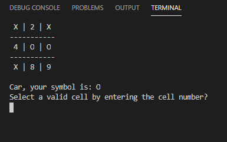

# TicTacToe - RUBY

> This is a TicTacToe game you can play in the command line. The objective is to apply OOP principles to the design of this game.

- [Project Description (Assignment 1)](https://www.theodinproject.com/courses/ruby-programming/lessons/oop)

## Prerequisites

- Ruby installed ([How to install](https://www.theodinproject.com/courses/web-development-101/lessons/installing-ruby))

## Start the game

- Clone/download this repo and change directory into the tictactoe folder.
- Make the file executable ([How to](https://commandercoriander.net/blog/2013/02/16/making-a-ruby-script-executable/)) or rename the "main" file in the "bin" directory to "main.rb".
- If the file is executable run "bin/main", otherwise run "ruby bin/main.rb"

## Screenshot

## Game Rules

- The board for this game is a grid that's 3 squares by 3 squares.
- The first player is X, the second player is O. Players take turns putting their marks in unmarked (numbered) squares.
- The first player to get 3 of her marks in a row (up, down, across, or diagonally) is the winner.
- When all 9 squares are full, the game is over. If no player has 3 marks in a row, the game ends in a tie.

## Game flow

1. Each player is asked for their name.
2. The board is displayed before each player marks a cell, so they can see the current game status.
3. Players take turns to mark a cell that is available by entering the number of the cell.
4. The game checks if there is a winner or a tie after each turn.

## Built With

- Ruby

## Authors

👤 **Carlos Prieto Barrón**

- Github: [@carlosprietobarron](https://github.com/carlosprietobarron)
- Twitter: [@CarlosA40795725](https://twitter.com/CarlosA40795725)

👤 **Sebastian Gil Rodriguez**

- Github: [@sebGilR](https://github.com/sebGilR)
- Twitter: [@sebGilR](https://twitter.com/sebGilR)
- Linkedin: [linkedin](https://www.linkedin.com/in/sebastiangilrodriguez)

## 🤝 Contributing

Contributions, issues and feature requests are welcome!

Feel free to check the [issues page](issues/).

## Show your support

Give a ⭐️ if you like this project!
